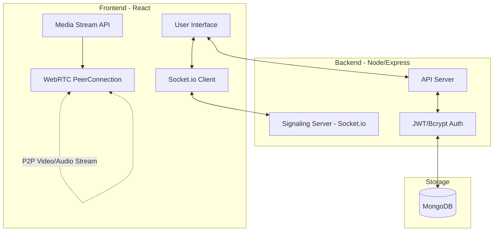

# Aspira - System Design & Workflow

This document outlines the architectural design, component interactions, and data workflows of the Aspira Video Conferencing platform.

---

## 🏛 High-Level Architecture

The system follows a **Client-Server Architecture** with a dedicated **Signaling Layer** for WebRTC connections.

---

## 🏗 Component Breakdown

### 1. Frontend (The Client)
- **State Management**: Uses React hooks (`useState`, `useEffect`, `useRef`) to manage meeting states and video streams.
- **WebRTC Manager**: Handles the lifecycle of `RTCPeerConnection`, including track management and local/remote stream rendering.
- **Socket Client**: Maintains a bi-directional link with the backend for real-time events.

### 2. Backend (The Infrastructure)
- **REST API Server**: Handles standard HTTP requests for user management and history.
- **Signaling Server (Socket.io)**: A critical component that acts as a "matchmaker" for WebRTC. It doesn't touch the video data; it only passes connection "handshakes".
- **Database Wrapper (Mongoose)**: Manages structured data storage in MongoDB.

---

## 🔄 Core Workflows

### 1. User Authentication Workflow
1.  **Request**: User submits credentials via the frontend.
2.  **Validation**: Backend hashes the input and compares it with the stored hash in **MongoDB**.
3.  **tokenization**: If valid, the backend signs a **JWT token**.
4.  **Response**: Token is sent to the frontend and stored in `localStorage` for future authorized requests.

### 2. WebRTC Connection Workflow (The Signaling Phase)
This is the most critical workflow in the system:
1.  **Lobby**: User A joins a room and captures their `localStream`.
2.  **Initiation**: User B joins the same room. The server notifies User A.
3.  **Offer**: User A creates an **SDP Offer** and sends it via Socket.io to the server.
4.  **Relay**: The server forwards the Offer to User B.
5.  **Answer**: User B sets the remote description, creates an **SDP Answer**, and sends it back to the server.
6.  **Relay**: The server forwards the Answer to User A.
7.  **ICE Candidates**: Simultaneously, both users exchange network details (ICE Candidates) via the server until a direct P2P path is found.
8.  **Streaming**: P2P connection is established; video data flows directly between users, bypassing the server.

### 3. Real-time Feature Workflow (Chat & Whiteboard)
- **Broadcasting**: When a user sends a message or draws on the canvas, the event is emitted to the server.
- **Selective Relay**: The server identifies the meeting room and broadcasts the data to all other connected sockets in that specific room.

---

## 📊 Data Schema Design

### User Document
- `name`: Full name.
- `username`: Unique identifier.
- `password`: Salted and hashed string.

### Meeting Log Document
- `user_id`: Reference to the user.
- `meetingCode`: The unique ID of the meeting room.
- `date`: Timestamp of the activity.

---

## 🛠 Scalability & Performance
- **Server Load**: Since video data is P2P (Peer-to-Peer), the server only handles small JSON packets for signaling, allowing it to support many concurrent meetings.
- **Latency**: STUN servers (Google STUN) are used to ensure connections can be established across different networks (NAT traversal).

---

## 📜 Metadata
- **Architecture Style**: MERN + P2P Signaling
- **Signaling Protocol**: WebSockets (Socket.io)
- **Media Protocol**: WebRTC (UDP-based)
