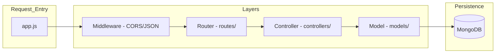

# Backend System Design & Internal Workflow

This document explains the internal architecture and logic flow of the **Aspira Backend**.

---

## 🏗 Backend Internal Architecture

The server follows a **Layered Architecture** pattern to separate concerns and ensure clean code.

---

## 📡 1. Signaling Mechanism (Detailed)

The signaling server is the most specialized part of this backend. It manages state for multiple "Rooms" (meetings).

### Internal State Management:
The server maintains three main in-memory objects:
- `connections`: Maps room paths to an array of `socket.id`s (e.g., `"/xyz": ["id1", "id2"]`).
- `messages`: Stores temporary chat history for participants joining later.
- `timeOnline`: Tracks when a socket connected.

### Signaling Sequence:
1.  **Join Init**: Client emits `join-call`. Server adds them to `connections[path]`.
2.  **Notification**: Server tells everyone in that room `user-joined`.
3.  **Encapsulation**: When a `signal` arrives from User A for User B, the server doesn't open it; it just calls `io.to(toId).emit("signal", ...)`. This ensures the server is just a **Messenger**.

---

## 🔐 2. Security & Authentication Design

### JWT Flow:
- **Key Generation**: Uses a `SECRET` key (from `.env`) to sign tokens.
- **Statelessness**: The backend doesn't store session data; the JWT itself contains the `username` and `id`, making it scalable.
- **Password Protection**: Uses **Bcrypt** with salt rounds. The plain text password is never stored or compared directly.

---

## 🍃 3. Database Strategy (Mongoose)

### Connection Handling:
- The backend uses an `async` start function to ensure the database is connected **before** the server starts listening on any port. This prevents "undefined" errors on early requests.

### Data Access Layer:
- **Controllers** communicate with **Models** using asynchronous `await` calls.
- `User.findOne()`: Used for login verification.
- `Meeting.collection.insertOne()`: Used to record activity logs efficiently.

---

## 🔄 4. Event-Driven Workflow (Internal)

1.  **Socket Connection**: The server detects a heartbeat.
2.  **Event Dispatching**: Based on the event name (`chat-message`, `whiteboardData`), the `socketManager` chooses whether to:
    - **Broadcast**: Send to everyone in the room (e.g., chat).
    - **Multicast**: Send to everyone except the sender (e.g., whiteboard).
    - **Unicast**: Send to one specific ID (e.g., WebRTC signal).

---

## 🛠 Tech Stack Rationale
- **Express 5.x**: Chosen for its robust routing and improved error handling.
- **Node.js Type="Module"**: Uses modern ES6 imports/exports for better modularity.
- **Socket.io**: Preferred over raw WebSockets because it handles automatic reconnections and "Rooms" out of the box.

---

## 📜 Metadata
- **Design Pattern**: Controller-Service-Repository (simplified)
- **Primary Protocol**: HTTP (APIs) & WebSockets (Signaling)
